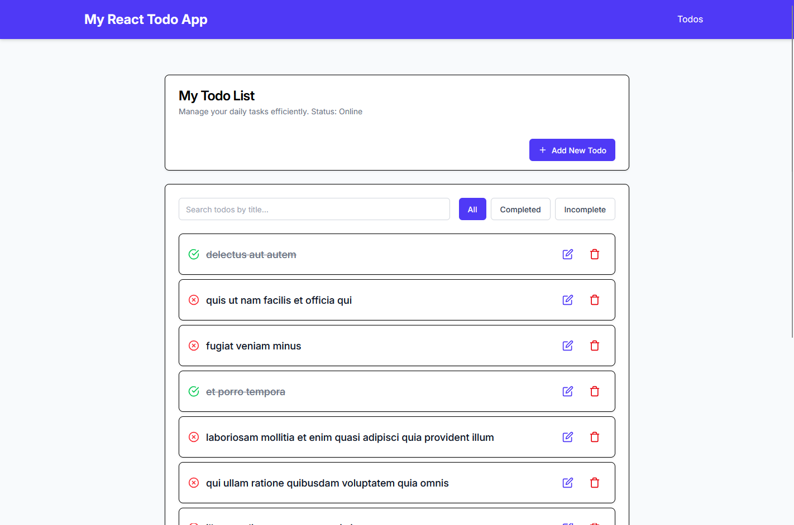
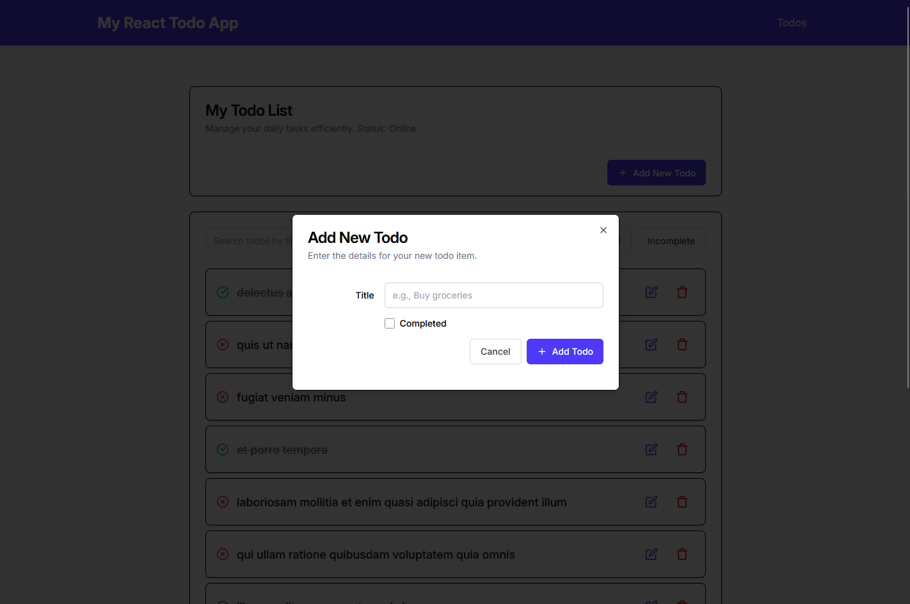

# My Todo App

A modern, responsive todo list application built with React, Tailwind CSS, and React Router v7. This app allows users to manage tasks efficiently with features like creating, editing, deleting, and viewing todos, along with search, filtering, pagination, and offline support. It integrates with the JSONPlaceholder API for data persistence and is optimized for mobile, tablet, and desktop devices.

## Table of Contents
- [Features](#features)
- [Installation and Setup](#installation-and-setup)
- [Available Scripts](#available-scripts)
- [Technology Stack](#technology-stack)
- [Architecture Decisions](#architecture-decisions)
- [API Documentation](#api-documentation)
- [Screenshots and Media](#screenshots-and-media)
- [Known Issues](#known-issues)
- [Future Improvements](#future-improvements)

## Features
- **CRUD Operations**: Create, read, update, and delete todos with a clean, modal-based interface.
- **Search and Filter**: Search todos by title and filter by status (all, completed, incomplete).
- **Pagination**: Navigate through todos with a responsive pagination component (10 items per page).
- **Offline Support**: Add, edit, and delete todos offline, with automatic sync when online.
- **Responsive Design**: Optimized for mobile (<640px), tablet (640px-1024px), and desktop (>1024px) with Tailwind CSS.
- **Dynamic Routing**: View detailed todo information via `/todos/:todoId` using React Router v7.
- **Error Handling**: Graceful handling of API errors and network issues with user-friendly messages.
- **Accessibility**: Includes `aria-label`, focus states, and touch-friendly controls (44x44px minimum).
- **Modern UI**: Sleek design with Tailwind CSS, Inter font, and custom components (e.g., `Button`, `Card`, `Dialog`).

## Installation and Setup
Follow these steps to set up the project locally.

## Prerequisites
- **Node.js**: Version 20 or higher
- **npm**: Version 10 or higher (comes with Node.js)
- **Git**: For cloning the repository

## Steps
1. **Clone the Repository**
    ```bash
    git clone https://github.com/yourusername/react-todo-app.git
    cd react-todo-app
2. **Install Dependencies**
    ```bash
    npm install
    ```
    This installs all required packages, including `react`, `react-dom`, `react-router`, `tailwindcss`, and `vite`.
3. **Configure Environment** 
    No environment variables are required, as the app uses the public JSONPlaceholder API 
    (`https://jsonplaceholder.typicode.com/todos`).
4. **Run Development Server**
    ```bash
    npm run dev
    ```
    The app will open at `http://localhost:5173` in your default browser.
5. **Build for Production**
    ```bash
    npm run build
    ```
    Outputs optimized files to the dist directory.

## Available Scripts
In the project directory, you can run the following commands:
- `npm run dev` Starts the development server with hot reloading at http://localhost:5173.
- `npm run build` Builds the app for production, outputting files to the dist folder.
- `npm run preview` Serves the production build locally at http://localhost:4173 for testing.


## Technology Stack
- **React v18**: Core library for building the UI with functional components and hooks.
- **React Router v7**: Handles client-side routing for /todos and /todos/:todoId.
- **Tailwind CSS**: Utility-first CSS framework for responsive, modern styling.
- **JSONPlaceholder API**: Mock API for todo data persistence.
- **Inter Font**: Clean, legible font for improved typography.
- **Vite**: Build tool for fast development and production builds with hot module replacement (HMR).
- **Prettier**: For code linting and formatting.

## Architecture Decisions
- **Component-Based Structure**: Reusable components (`Button`, `Input`, `Checkbox`, `Card`, `Dialog`) promote modularity and consistency.
- **Declarative Routing**: React Router v7’s `<Routes>` and `<Route>` provide simple, maintainable navigation.
- **State Management**: Local component state with `useState` and `useEffect` for simplicity, as global state (e.g., Redux) isn’t needed for this scope.
- **Offline Support**: Custom `performOperation` and `syncPendingOperations` utilities cache operations in local storage for offline CRUD.
- **Responsive Design**: Tailwind’s responsive utilities (e.g., `sm:`,` md:`, `lg:`).
- **API Integration**: JSONPlaceholder provides a reliable mock backend, avoiding the need for a custom server.
- **Error Handling**: Centralized error handling in `fetchData` and component-level UI feedback (e.g., error cards, modal messages).
- **Accessibility**: WCAG-compliant touch targets (44x44px), `aria-label`, and focus management enhance usability.

## API Documentation
The app uses the JSONPlaceholder API for todo data. Below are the endpoints and their usage.

### Endpoints
- #### List Todos
    - **URL**: `GET https://jsonplaceholder.typicode.com/todos`
    - **Response**: Array of todo objects (e.g., `{ id, userId, title, completed }`)
    - **Usage**: Fetches all todos on the `/todos` page load.
- #### Get Todo by ID
    - **URL**: `GET https://jsonplaceholder.typicode.com/todos/:id`
    - **Response**: Single todo object
    - **Usage**: Displays details on `/todos/:todoId`.
- #### Create Todo
    - **URL**: `POST https://jsonplaceholder.typicode.com/todos`
    - **Body**: `{ title: string, completed: boolean, userId: number }`
    - **Response**: Created todo object
    - **Usage**: Adds a new todo via the “Add New Todo” modal.
- #### Update Todo
    - **URL:** `PUT https://jsonplaceholder.typicode.com/todos/:id`
    - **Body:** `{ title: string, completed: boolean }`
    - **Response:** Updated todo object
    - **Usage:** Edits a todo via the “Edit Todo” modal.
- #### Delete Todo
    - **URL**: DELETE `https://jsonplaceholder.typicode.com/todos/:id`
    - **Response**: Empty response (status 200)
    - **Usage**: Deletes a todo via the “Confirm Deletion” modal.

## Screenshots and Media

### Todo List Page

*Displays todos with search, filter, pagination, and action buttons.*
### Todo Detail Page

*Displays todos with search, filter, pagination, and action buttons.*
### Add Todo Modal

*Form for creating a new todo with title and completed status.*

## Known Issues
- **JSONPlaceholder Limitations**: The API is read-only for actual persistence; updates/deletes are simulated and reset on refresh.
- **Long Todo Titles**: Titles longer than ~50 characters may truncate on mobile without a tooltip (mitigated with `truncate` class).
- **Offline Sync Edge Cases**: Rapid offline/online toggling may cause sync conflicts (rare, not fully tested).
- **Testing Suite**: No unit/integration tests currently implemented.
- **IE11 Support**: Not tested, as Tailwind and React v18 target modern browsers.

##Future Improvements
- **Real Backend**: Replace JSONPlaceholder with a custom backend (e.g., Node.js, Firebase) for true persistence.
- **Unit Tests**: Add Jest and React Testing Library for component and API tests.
- **Global State**: Introduce Zustand or Context for complex state management if features grow.
- **Advanced Search**: Support filtering by userId or date.
- **Tooltip for Titles**: Show full todo titles on hover for truncated text.
- **Dark Mode**: Implement a theme toggle with Tailwind’s dark: variants.
- **TypeScript**: Migrate to TypeScript for type safety with React Router v7’s improved types.
- **PWA Support**: Add a service worker for enhanced offline capabilities and installability.
- **Analytics**: Integrate tracking (e.g., Google Analytics) for user behavior insights.